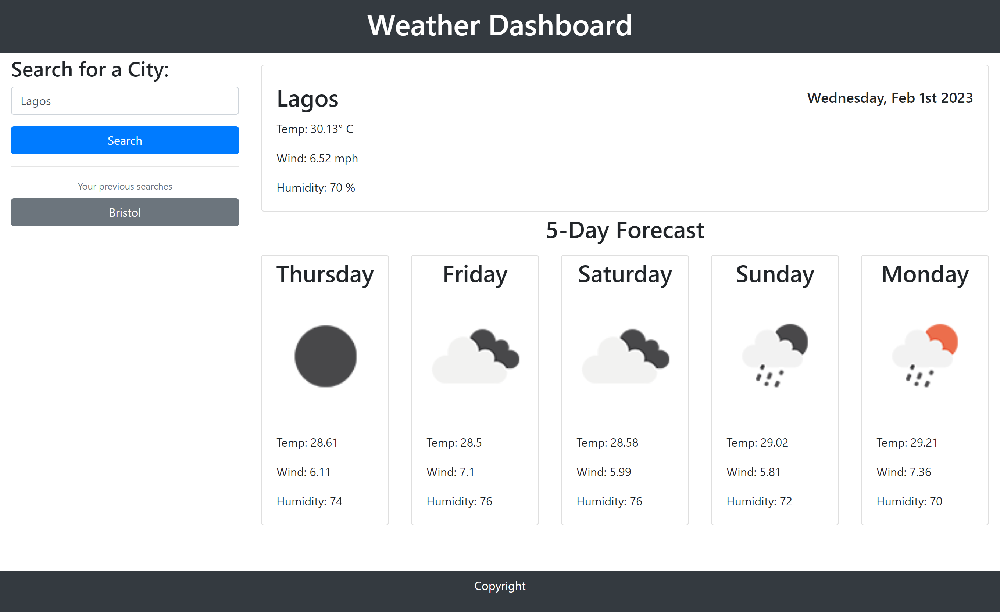

 

  <h1 align="center">WeatherNow or Later</h1>
  

    A simple web based application that allows users to see the weather forecast for any city.
     
    <a href="https://osmantolo.github.io/weather_now-apis-javascript/">View Demo</a>
  

## About The Project

This repo presents a weather forecast application that allows a user to live weather information and view the five day weather forecast for any city. The app will run in the browser and feature dynamically updated HTML, CSS, jQuery and vanilla JavaScript.

The user is presented with an aside section that contain user a user input field for typing the name of any city. Upon searching for a city, the current weather conditions for that city is presented from a query to [OpenWeather API](https://openweathermap.org/api), along with the current date using [Moment.js](https://momentjs.com/) library. The user is further presented with a five day forecast for the searched location. The user can also access their previous searched cities.

The repo serves as my solution to the Module 8 - Weather Dashboard Challenge of Trilogy Skills Front-End Development Boot Camp. This app wil run in the browser, and will feature dynamically updated HTML and CSS powered by JavaScript. A clean responsive and accessible user interface is presented for multiple screen sizes.

The project provide evidence of my ability to fetch data from a third party API, and analyse, manipulate, and present the data using JavaScript's Web APIs, and jQuery. The result is a user friendly web app that can be accessed by anyone with an internet connection.

## Usage

Visit this github page [link](https://github.com/OsmanTolo/weather_now-apis-javascript) to access the website. The app is web page based, so the user can interface with the controls just by clicking UI elements on the page.

## License

Distributed under the MIT License.

## Contact

Osman Dumbuya - [@OsmanTolo\_](https://twitter.com/OsmanTolo_)

Project Link: [https://github.com/OsmanTolo/weather_now-apis-javascript](https://github.com/OsmanTolo/weather_now-apis-javascript)

## Acknowledgments

- [Skills for Life](https://skillsforlife.campaign.gov.uk/courses/skills-bootcamps/)
- [Othneil Drew's Best-README-Template](https://github.com/othneildrew/Best-README-Template)
